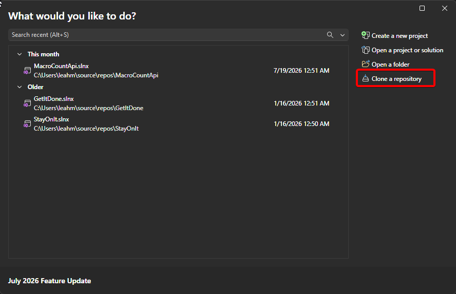
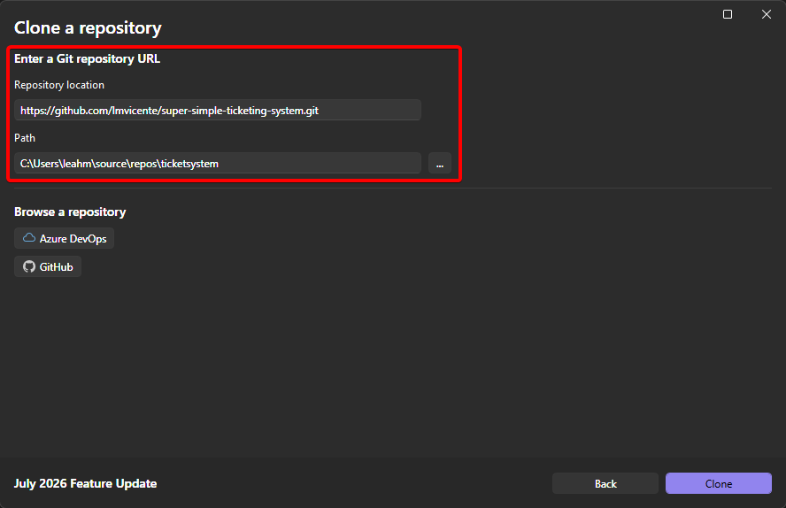
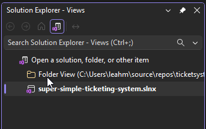
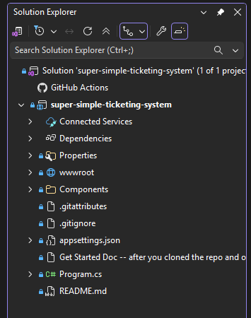
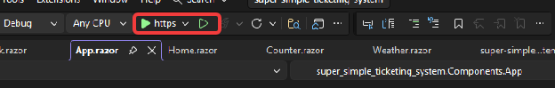
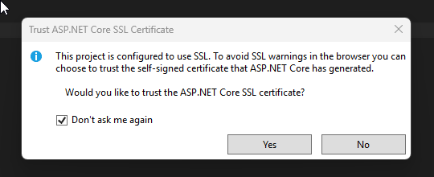
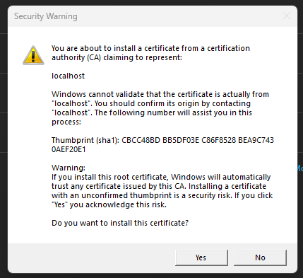
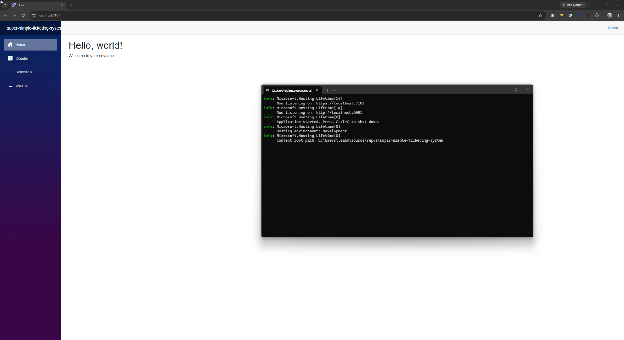

# Super Simple Ticketing System

A practice project. Right now it's just the default Blazor template with the sample pages still in it.

**Your job at this stage is to break it.** Change things, see what happens, undo it if you hate it. There's no database and no real data, so there is genuinely nothing you can ruin. We'll start building the actual ticketing system once everyone's comfortable moving around the project.

If you've never used Git before, that's expected. Everything below assumes you haven't.

---

# Part 1 — Install Visual Studio

Download **Visual Studio 2026** (Community edition is free) from https://visualstudio.microsoft.com/

During install you'll be asked which workloads you want. Tick **ASP.NET and web development**. That gets you the .NET SDK, the Blazor tooling, and Git — all of it — so there's nothing else to install separately.

If you already have Visual Studio but skipped that workload, open **Visual Studio Installer** from the Start menu, hit Modify, and add it.

---

# Part 2 — Clone the repo

"Cloning" means downloading your own copy of the project, along with its full history of every change ever made to it.

### 1. Open Visual Studio

You'll land on the start window. Click **Clone a repository** on the right.



### 2. Fill in the repo URL and where to put it

**Repository location:**

```
https://github.com/lmvicente/super-simple-ticketing-system.git
```

**Path:** wherever you want it on your machine. Point it at a **new, empty folder** — don't drop it into a folder that already has stuff in it.



Click **Clone** at the bottom right.

### 3. Sign in to GitHub when it asks

A browser window will pop open the first time. Sign in there and Visual Studio remembers you afterward.

### 4. Make sure you're looking at the solution

This trips everyone up. After cloning, Visual Studio sometimes shows you the raw **Folder View** instead of the solution, and the project looks wrong — no proper structure, nothing to run.

Look at the top of Solution Explorer. If you see "Folder View," click **super-simple-ticketing-system.slnx** to switch:



Once you're in the solution it should look like this — Components, wwwroot, Program.cs, and the rest:



That's what you want.

---

# Part 3 — Run it

Click the green play button at the top. Make sure it says **https** next to it.

The **filled** triangle runs with the debugger attached. The **hollow** one runs without. The debugger gives you a console window and lets you pause the code and inspect what's happening — useful, and worth getting used to. Either works.



### The certificate prompts

This project uses HTTPS. If you've never run a .NET web project on this machine, you'll get two prompts the first time only.

First this one. Click **Yes**:



Then this one. Also **Yes**:



Both are just trusting a certificate Visual Studio generated for your own machine so your browser stops complaining about `localhost`. Nothing is leaving your computer.

### You should see this



A home page, and a nav menu with Counter, Homework, and Weather. That's the whole app right now. The console window in the screenshot is the debugger — you won't see it if you ran with the hollow button, which is fine.

To stop it: the red square in the toolbar, or just close the browser tab and hit stop.

---

# Part 4 — Make your own branch

**Do this before you edit anything.**

### Why

`main` is the shared official version of the project. If we all edit `main` directly, we overwrite each other's work and someone loses an evening.

A **branch** is your own personal copy of the project that you can wreck freely. Your changes live on your branch and don't touch anyone else's. If you completely destroy it, we delete it and make a fresh one — no harm done.

### Making one

Look at the **bottom right corner of Visual Studio**. There's a branch indicator there — it currently says `main`. Click it, then **New Branch**.

Name it with your name in front:

```
bob/homework
```

Leave "Based on" set to `main` and make sure **Checkout branch** is ticked. Create it.

The bottom right corner should now show your branch name instead of `main`.

### Check this every time you sit down

Glance at that bottom right corner before you start working. If it says `main`, you're on the wrong branch — click it and switch to yours. Two seconds, saves a cleanup.

---

# Part 5 — What's in here

```
Components/
  Layout/
    MainLayout.razor     The shell — everything renders inside this
    NavMenu.razor        The sidebar links
  Pages/
    Home.razor           The landing page
    Counter.razor        A button that increments a number
    Homework.razor       Your assignment
    Weather.razor        A table of fake data
  App.razor              The root HTML document
wwwroot/                 CSS, images, Bootstrap
Program.cs               Startup and configuration
```

**Read `Weather.razor` first.** It's commented line by line — what the `@code` block is, what the model class does, how the loop builds table rows. It covers most of what you need. `Counter.razor` is the smallest possible example of a button that does something.

**Then read `Homework.razor`** for the actual assignment, and the long comment at the top of it explaining render modes. That comment answers the "why is my button doing nothing" question before you hit it.

---

# Part 6 — Saving your work with Git

Three things happen, in order, and they are **not** the same thing:

| | What it does | Where your work ends up |
|---|---|---|
| **Stage** | Pick which changed files to include | Nowhere yet |
| **Commit** | Save a snapshot with a message | Your computer only |
| **Push** | Send it up to GitHub | On the server, where I can see it |

The one people get wrong: **committing does not share anything.** You can commit twenty times and if you never push, nobody sees a thing. Push is the step that matters for turning it in.

### Doing it in Visual Studio

Open **View → Git Changes**. This panel is where you'll live.

1. **Check the branch name at the top.** Yours, not `main`.
2. Your changed files are listed under Changes. Hit the **+** next to a file to stage it, or the **+** on the Changes header to stage everything.
3. Type a message in the box. Describe what you did — "Styled home page and added a card," not "stuff."
4. Click **Commit Staged**.
5. Click **Push** (the up arrow at the top of the panel, or Git menu → Push).

The very first push on a new branch, Visual Studio may ask you to confirm creating the branch on GitHub. Say yes.

### Commit often

Every time something works, commit. They're cheap, and small commits are much easier to undo than one giant one.

### What I want when you turn it in

- Your own branch, with your name in it
- **At least three commits** with messages that describe what you actually did
- **Pushed.** Committed but not pushed means I can't see it.
- Push it even if it's half-finished or broken. Especially then.

### Did it actually work?

Go to https://github.com/lmvicente/super-simple-ticketing-system in a browser and click the branch dropdown. Your branch should be in the list, and clicking it should show your commits. If it's not there, the push didn't go through — check Git Changes for an error and message me.

---

# Part 7 — When something goes wrong

You will break something. It's fine, and it's genuinely hard to permanently lose work.

**"Which branch am I on?"**
Bottom right corner of the window. Always.

**"I broke a file and want it back."**
In **Git Changes**, right-click the file → **Undo Changes**. It goes back to how it was at your last commit.

**"What did I actually change?"**
Double-click a file in Git Changes. You get a side-by-side view — old on the left, yours on the right.

**"I want the latest from main."**
Switch to `main` (bottom right corner), then Git menu → **Pull**. Then switch back to your branch.

**"I committed to `main` by accident."**
Message me. It's a two-minute fix and completely recoverable, but the steps depend on what you've done since.

**Anything scarier** — merge conflicts, a wall of red text, something about "detached HEAD" — stop and message me. Don't start googling and pasting commands you don't recognize. That's how a small problem turns into a big one.

---

# Stuck?

Ask. Paste the actual error text — "it doesn't work" takes ten messages to sort out, the error message usually takes one. Screenshots are fine.

Push whatever you've got, even half-finished or broken. It's far easier to help when I can see the code.
